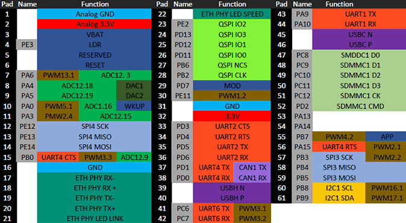
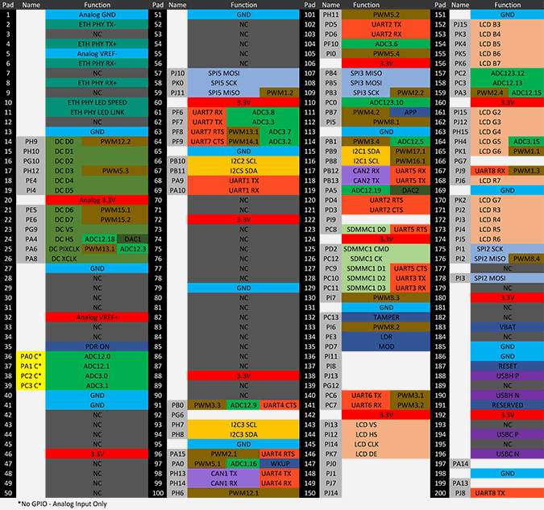
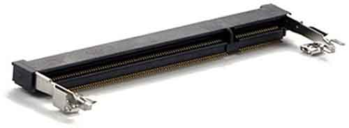
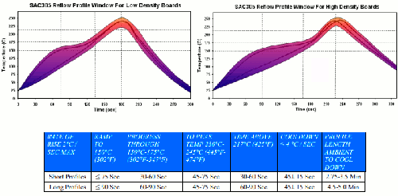

# SITCore System on Modules
---

## Overview
The SITCore SoMs provide a low cost way to add .NET computing power to any embedded product. They are available in a 200 pin SO-DIMM format or as surface mount modules. The SITCore SoMs let you design IoT products that are secure, easily integrated with the cloud, and can be easily managed and updated from the cloud for deployments of one to a million or more. The surface mount versions are great for harsh or high vibration environments.

## Specifications

| Spec                   | All SITCore SoMs          |
|------------------------|---------------------------|
| **Processor Type**     | ARM Cortex-M7 32 Bit      |
| **Speed**              | 480 MHz                   |
| **Internal RAM**       | 1 MByte                   |
| **Internal Flash**     | 2 MByte                   |
| **Instruction Cache**  | 16 KByte                  |
| **Data Cache**         | 16 KByte                  |
| **Temperature Range**  | -40C to +85C              |

*Note: Resources are shared between your application and the operating system.*

## Peripherals

| Peripheral                 | SCM20100E     | SCM20260N     | SCM20260E     | SCM20260D     |
|----------------------------|---------------|---------------|---------------|---------------|
| **External SDRAM**         | None          | 32 MByte      | 32 MByte      | 32 MByte      |
| **External Flash**         | None          | 16 MByte      | 16 MByte      | 16 MByte      |
| **GPIO**                   | 43            | 79            | 85            | 108           |
| **SPI**                    | 3             | 3             | 3             | 3             |
| **I2C**                    | 1             | 1             | 3             | 3             |
| **UART**                   | 4 (2 w/ H.S.) | 7 (4 w/ H.S.) | 8 (4 w/ H.S.) | 8 (4 w/ H.S.) |
| **CAN**                    | 1             | 2             | 2             | 2             |
| **PWM**                    | 12            | 22            | 23            | 28            |
| **ADC**                    | 6             | 16            | 15            | 20            |
| **DAC**                    | 2             | 2             | 1             | 2             |
| **SD/SDIP/MMC**            | 1             | 1             | 1             | 1             |
| **USB Host**               | 1             | 1             | 1             | 1             |
| **USB Client**             | 1             | 1             | 1             | 1             |
| **Ethernet**               | 1             | 0             | 1             | 1             |
| **LCD TFT**                | 0             | 1             | 1             | 1             |
| **Camera**                 | 0             | 1             | 1             | 1             |

*Note: As many pins share peripherals, not all peripherals will be available.*

### Using Interrupts (IRQs)

The microcontrollers we use in our SITCore line of products do not support concurrent interrupts with the same pin number, even if the pins are on different ports (the port is denoted by the second letter of the GPIO pin name -- PA1 is pin 1 on port A). Therefore, interrupts are available on only 16 pins at any given time. For example, pins PA1 and PB1 cannot be used as interrupt pins at the same time, but PA1 and PB2 can. PA1 and PA2 can also be used with interrupts simultaneously.

## Features
* Low power modes including three independently controllable power domains
* RTC
* Watchdog
* Threading
* TCP/IP with SSL
  * Full .NET socket interface
  * Ethernet
  * PPP
* Graphics
  * Images
  * Fonts
  * Controls
* File System
  * Full .NET file interface
  * SD cards
  * USB drives
* Signal controls
  * Generation
  * Capture
  * Pulse measurement
    
## Module Pinouts

### SCM20100E Pinout

### SCM20260N Pinout

### SCM20260E Pinout

### SCM20260D Pinout

## Schematics
- [SCM20100E Schematic](pdfs/scm20100e-rev-b-schematic.pdf)
- [SCM20260N Schematic](pdfs/scm20260n-rev-c-schematic.pdf)
- [SCM20260E Schematic](pdfs/scm20260e-rev-b-schematic.pdf)
- [SCM20260D Schematic](pdfs/scm20260d-rev-c-schematic.pdf)

## 3D STEP files
- [SCM20100E STEP File](http://files.ghielectronics.com/downloads/3D/SITCore/SoM/SCM20100E%20Rev%20B.step)
- [SCM20260N STEP File](http://files.ghielectronics.com/downloads/3D/SITCore/SoM/SCM20260N%20Rev%20C.step)
- [SCM20260E STEP File](http://files.ghielectronics.com/downloads/3D/SITCore/SoM/SCM20260E%20Rev%20B.step)
- [SCM20260D STEP File](http://files.ghielectronics.com/downloads/3D/SITCore/SoM/SCM20260D%20Rev%20C.step)

## Getting Started
As the SITCore modules are based on the SITCore chipset, please refer to the [SITCore SoC page](soc.md) for information on device startup, loading TinyCLR OS firmware, and writing and deploying your application.

## Design Considerations

### Footprints

We recommend no traces or vias under the module. Dimensions are in inches.

#### SCM20100E Recommended Footprint

#### SCM20260N Recommended Footprint

#### SCM20260E Recommended Footprint

### SCM20260D SO-DIMM Socket

The SCM20260D uses the same 200 pin SO-DIMM socket that was originally made for DDR2 memory modules. You can make a custom SO-DIMM SITCore circuit board by adding the appropriate SO-DIMM socket to your circuit board.

> [!Tip]
> Make sure to expose the required pins in your design. Specific pins are needed for device programming, updates, recovery, and WiFi firmware updates. See the [**Special Pins**](../../software/tinyclr/special-pins.md) page and the device specifications for details.

SO-DIMM stands for Small Outline Dual Inline Memory Module. There are two different 200 pin SO-DIMM sockets, those made for DDR memory and those made for DDR2 memory. They are identical except for the orientation notch which is in a slightly different position. These sockets are not interchangeable. There is also a 204 pin SO-DIMM socket for DDR3 memory with the notch positioned closer to the center of the module.

> [!Note]
> Our UCMs are only compatible with DDR2 type 200 pin SO-DIMM sockets.

Here is a link to the manufacturer's web page for the connector we use on our boards: [EMBOSS ASSY DDR2 SODIMM SOCKET 200P 5.2H](http://www.te.com/usa-en/product-1565917-4.html)

### Required Pins
Exposing the following pins is required in every design to enable device programming, updates, and recovery:
* RESET
* LDR
* APP
* MOD (if required to select a debug interface)
* Desired debug interface(s)

For information on these and other important pins, please refer to the [Special Pins](../../software/tinyclr/special-pins.md) page.

### Power Supply
A clean power source, suitable for digital circuitry, is needed to power SITCore SoMs. Voltages should be regulated to within 10% or better of the specified voltage. Additionally, a large capacitor, typically 47 uF, should be placed near the SoM if the power supply is more than few inches away.

### Analog Considerations
Where these pins are provided, using a separate filtered supply for `Analog 3.3V` and `Analog VREF+` may help to improve ADC accuracy by reducing analog supply noise. For the same reason, you may want to provide a separate and clean analog ground for the `Analog GND` and `Analog VREF-`, if these pads are provided on the SoM you are using.

### Oven Reflow Profile

SITCore SoMs are not sealed for moisture. Baking modules before reflow is recommended and required in a humid environment. The process of reflow can damage the SoM if the temperature is too high or exposure is too long.

The lead-free reflow profiles used by GHI Electronics are shown below. The profiles are based on AIM SAC 305 solder (3% silver, 0.5% copper). The thermal mass of the assembled board and the sensitivity of the components on it affect the total dwell time. Differences in the two profiles are where they reach their respective peak temperatures as well as the time above liquids (TAL). The shorter profile applies to smaller assemblies, whereas the longer profile applies to larger assemblies such as back-planes or high-density boards. The process window is described by the shaded area. These profiles are only starting-points and general guidance. The particulars of the oven and the assembly will determine the final process.

## SITCore Dev Boards

We offer SITCore development boards to get you started as quickly and easily as possible. These boards allow you to start programming in minutes, and are suitable for both prototypes and production. Click [here](dev.md) for details.
