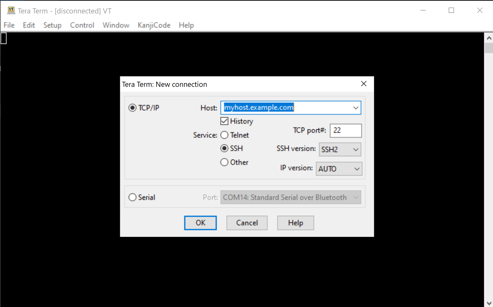
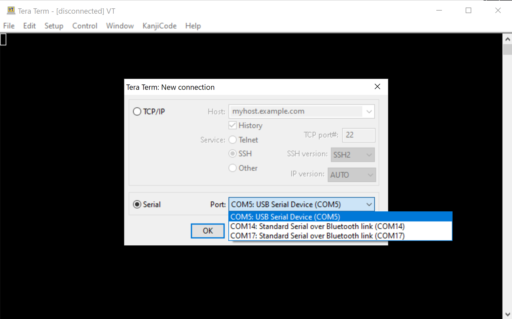

# Getting Started

---

This page explains how to load and use MicroPython on the GHI Electronics supported devices.

---
## The Terminal Software
Tera Term is the recommended terminal software but any other software should work. Tera Term is free and widely used. Download Tera Term from the [downloads](downloads.md) page or directly or search the web for downloads.

Unzip the downloaded file and run `ttermpro.exe`. The software will look like the image below.

Go ahead and clock cancel on this page.

The next step is to put the device in `Loader` mode. This is accomplished by setting LDR pin low during reset or power up. On devices that have LDR button, just hold the LDR button down and continue to hold it down while reseting the board and then release the LDR button. This step will bring the device into loader mode, which will load a new virtual serial port. On windows, the `Device Manager` will look something like the image below.

Go back to Tera Term and, from the top menu, select `File->New connection...`. A new window will pop-up with serial ports updated with the COM port we have introduced in previous step. Select that new port and click OK.

Hit the enter key and the device should respond with `Invalid Command.` Try to hit `v` followed by enter and the device will respond with the boot loader verions number.

The device is now ready for the MicroPython firmware.

## The MicroPyhon Firmware
Download the firmware from the [Downloads](downloads.md) page.

> [!Tip]
> MicroPython is not available for all products.

Back to Tera Term, press `U` followed by enter. The device will respond with `Are you sure (Y/N)?` Now press 'Y' followed by enter.'

The device will now will be sending `CCCCCCC.....` indicating that it is ready for the MicroPython file.

From top menu, `File->Transfer->XMODEM->Send...`. This is an important, commonly missed step, you MUST select the `1K` checkbox!

Select the downloaded MicroPython file (glb file type) from earlier step. Progress window will show the update status. When upload has completed, reset the board.

If the firmware was loaded successfully, the PC will see a virtual memory driver, just like a USB memory drive. The drive will contain multiple files, one of them is `main.py`, which is what MicroPyhton automatically runs on power up. The device will also bring up a vistual COM port, just like the one used in loader mode but this COM is for the REPL interface.

---

## Tutorials

The [**tutorials**](tutorials/intro.md) is a good next step.
