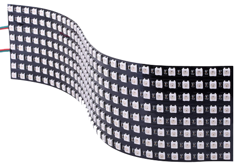
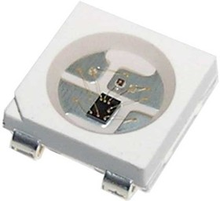

# LED Drivers

---

## LED Matrices



This example uses the WS2812 LED but applies to all matrices.

> [!TIP]
> Needed NuGets: GHIElectronics.TinyCLR.Drivers.Worldsemi.WS2812, GHIElectronics.TinyCLR.Drivers.BasicGraphis

LedMatrix Class
```cs
class LedMatrix : BasicGraphics {
	private uint row, column;
	WS2812Controller leds;

	public LedMatrix(GpioPin pin, uint column, uint row) { 
		this.row = row;
		this.column = column;
		this.leds = new WS2812Controller(pin, this.row * this.column, WS2812Controller.DataFormat.rgb565);

		Clear();
	}

	public override void Clear() {
		leds.Clear();
	}

	public override void SetPixel(int x, int y, uint color) {
		if (x < 0 || x >= this.column) return;
		if (y < 0 || y >= this.row) return;

		// even columns are inverted
		if ((x & 0x01) != 0) {
			y = (int)(this.row - 1 - y);
		}

		var index = x * this.row + y;

		leds.SetColor((int)index, (byte)(color >> 16), (byte)(color >> 8), (byte)(color >> 0));
	}
	public void Flush() {
		leds.Flush();
	}
}
```
Use the LEDMatrix Class as shown

```cs
var pin = GpioController.GetDefault().OpenPin(SC20100.GpioPin.PC6);
var screen = new LedMatrix(pin, 8, 32);

screen.Clear();
var col = LedMatrix.ColorFromRgb(0, 20, 50);

var c = 0;
while (true){
    screen.Clear();
    screen.DrawString(c++.ToString(), col, 0, 0);
    screen.Flush();
    Thread.Sleep(10);
}
```
---



## WS2812

The WS2812 driver is implemented natively. It supports 565 and 888 color formats.

> [!Note]
> These LEDs are commonly referred to as Neopixel

> [!TIP]
> Needed NuGet: GHIElectronics.TinyCLR.Drivers.Worldsemi.WS2812


```cs
const int NUM_LED = 4; // 4 leds
var pin = GpioController.GetDefault().OpenPin(SC20260.GpioPin.PA0);
var leds = new WS2812Controller(pin, NUM_LED, WS2812Controller.DataFormat.rgb888);
leds.SetColor(0, 0xFF, 0, 0); // red
leds.SetColor(1, 0, 0xFF, 0); // green
leds.SetColor(2, 0, 0, 0xFF); // blue
leds.SetColor(3, 0xFF, 0xFF, 0xFF); // white
leds.Flush();
```

---


## APA102C

> [!TIP]
> Needed NuGet: GHIElectronics.TinyCLR.Drivers.ShijiLighting.APA102C

The APA102C is very similar to the Neopixel WS2812 except it uses standard 3 wire SPI, while the Neopixel uses a single wire and it's own proprietary format. 

```cs
var cs = GpioController.GetDefault().OpenPin(SC20260.GpioPin.PE4);

var settings = new SpiConnectionSettings() {
    ChipSelectType = SpiChipSelectType.Gpio,
    ChipSelectLine = cs,
    Mode = SpiMode.Mode1,
    ClockFrequency = 4_000_000,
};

var spiBus = SpiController.FromName(SC20100.SpiBus.Spi4);
var led = new APA102CCController(spiBus, 24);

led.SetColor(1, 255, 0, 0); // 2nd LED is Red
led.Flush();
```


---
## LPD8806

> [!TIP]
> Needed NuGet: GHIElectronics.TinyCLR.Drivers.GreeledElectronics.LPD8806

```cs
var cs = GpioController.GetDefault().OpenPin(SC20260.GpioPin.PE4);

var settings = new SpiConnectionSettings() {
    ChipSelectType = SpiChipSelectType.Gpio,
    ChipSelectLine = cs,
    Mode = SpiMode.Mode1,
    ClockFrequency = 4_000_000,
};

var spiBus = SpiController.FromName(SC20100.SpiBus.Spi4);
var led = new LPD8806Controller(spiBus, 24);

led.SetColor(1, 255, 0, 0); // 2nd LED is Red
led.Flush();
```


