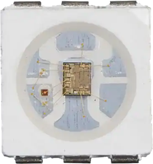

# LED Drivers
---



## WS2812
The WS2812 uses digital signal or signal generator to control LEDs. Read more about digital signals [here](../tutorials/signal-control.md). Digital signal can only use specific pins, but is very accurate. Signal generator can be used on any pins but is less accurate. 

>[!Note]
>These LEDs are commonly referred to as Neopixel

>[!TIP]
>Needed NuGet: GHIElectronics.TinyCLR.Drivers.Worldsemi.WS2812

Digital Signal
```cs
var gpio = GpioController.GetDefault();
var digitalSignalPin = gpio.OpenPin(SC20260.Timer.DigitalSignal.Controller5.PA0);
var digitalSignal = new DigitalSignal(digitalSignalPin);

var led = new WS2812Controller (digitalSignal, 24);

led.SetColor(1, 255, 0, 0); // 2nd LED is Red
led.Flush();
```

Signal Generator
```cs
var gpio = GpioController.GetDefault();
var signalPin = gpio.OpenPin(SC20260.GpioPin.PE11);
var signalGen = new SignalGenerator(signalPin);

var led = new WS2812Controller(signalGen, 24);

led.SetColor(1, 255, 0, 0); // 2nd LED is Red
led.Flush();
```
---

## APA102C

>[!TIP]
>Needed NuGet: GHIElectronics.TinyCLR.Drivers.ShijiLighting.APA102C

```cs
var cs = GpioController.GetDefault().OpenPin(SC20260.GpioPin.PE4);

var settings = new SpiConnectionSettings() {
    ChipSelectType = SpiChipSelectType.Gpio,
    ChipSelectLine = cs,
    Mode = SpiMode.Mode1,
    ClockFrequency = 4_000_000,
};

var spiBus = SpiController.FromName(SC20100.SpiBus.Spi4);
var led = new APA102CCController(spiBus, 24);

led.SetColor(1, 255, 0, 0); // 2nd LED is Red
led.Flush();
```


---
## LPD8806

>[!TIP]
>Needed NuGet: GHIElectronics.TinyCLR.Drivers.GreeledElectronics.LPD8806

```cs
var cs = GpioController.GetDefault().OpenPin(SC20260.GpioPin.PE4);

var settings = new SpiConnectionSettings() {
    ChipSelectType = SpiChipSelectType.Gpio,
    ChipSelectLine = cs,
    Mode = SpiMode.Mode1,
    ClockFrequency = 4_000_000,
};

var spiBus = SpiController.FromName(SC20100.SpiBus.Spi4);
var led = new LPD8806Controller(spiBus, 24);

led.SetColor(1, 255, 0, 0); // 2nd LED is Red
led.Flush();
```


