# Adafruit IO
---
The Adafruit cloud, Adafruit IO, is a cloud service primarily aimed at the maker market. While Adafruit IO is more limited than the major players in cloud services, it is very easy to use and there's a free option making this a great way to test IoT proofs of concept and prototypes.

We'll need create a few things for our code. We'll need an Adafruit Certificate, a dashboardID, a username, a password key, and a feed to subscribe to. 

First add an Adafruit Certificate to our resources and then add it to line of code below.


```cs
var caCertSource = Properties.Resources.GetBytes(Properties.Resources.BinaryResources.DigiCertGlobalRootG2);
```
Next, we'll create a 'Dashboard', from the Dashboards page. Click on 'Create a New Dashboard' found inside the 'Actions' dropdown. 


Create a meaningful name for our Dashboard. This will be the 'dashboardID' inside our code sample. 

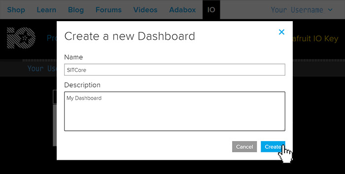

Click on our newly created 'Dashboard'

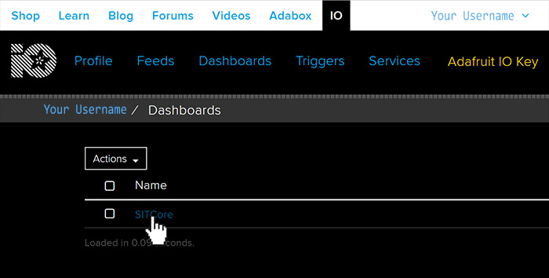

This opens the Dashboard canvas for our project. This is where we will add blocks to control our IoT device. Click on '+' to create a new block. 

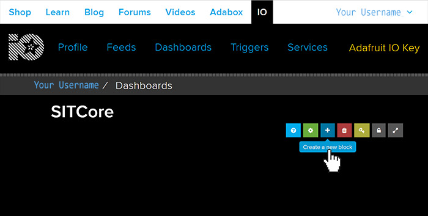

Let's add our first block to the canvas. There are many kinds of blocks you can add, for this we'll first add a 'Toggle' block. Click on the 'Toggle' block. 

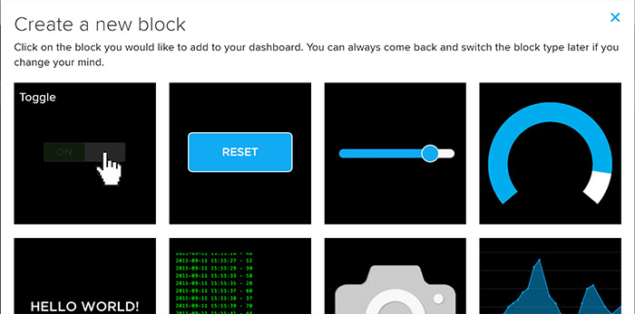

We need to create a 'feed' name to attach to our newly created block. Enter a name for the feed and click 'Create'. In our example we'll call this block's feed 'ToggleSwitch'


Check the box of the newly created feed and click 'Next Step'

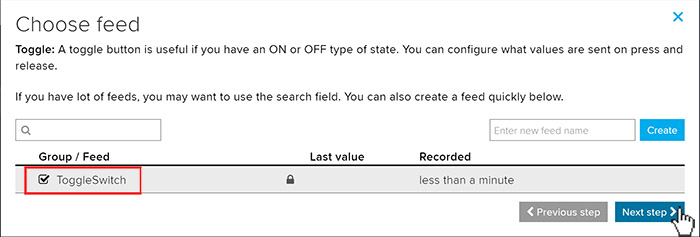

Here we can set the Text we want to use that appears on the button and the value the button will send when used. Let's change the Button value to 1 for on and 0 for off. Then click 'Create block'

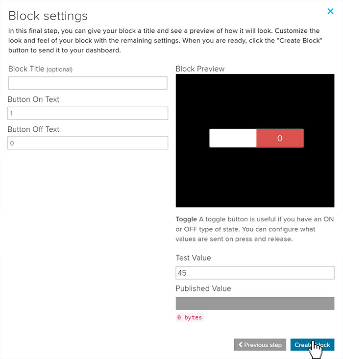

The new Toogle we created now appears in the Dashboard canvas, the blocks can be placed anywhere we like on the Dashboard. But let's add another block first. 

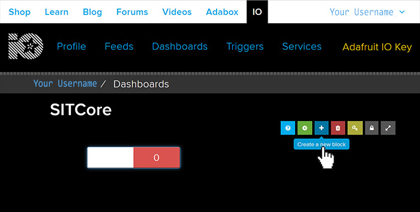

Let's add a 'Gauge' block to our canvas next. 


Like we did the ToggleSwitch feed, we need to create a feed for the Gauge. We'll just call the feed 'Gauge', click on the 'Create', select the 'Gauge' and click 'Next step'

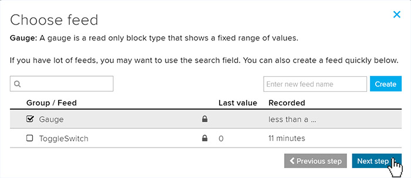

There are several setting we can adjust but for this tutorial we'll just us the default and click on 'Create block'

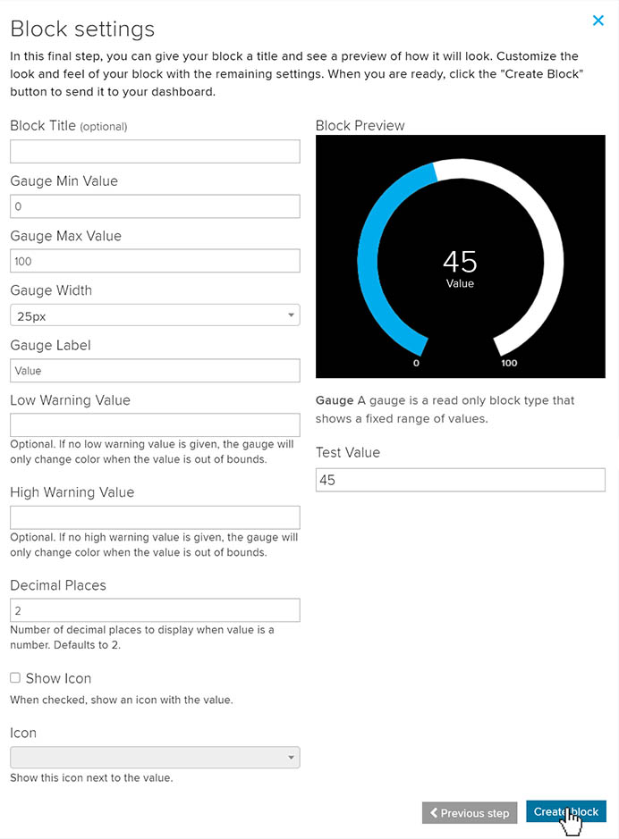

We can see that the gauge has been added to our Dashboard Canvas. The final element we need for our code is an 'Adafruit IO Key'. Click on it located in the top menu. 

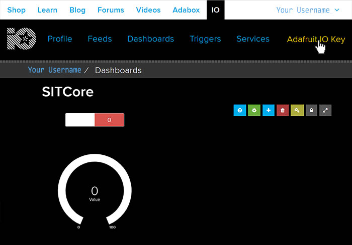

Copy the generated key...

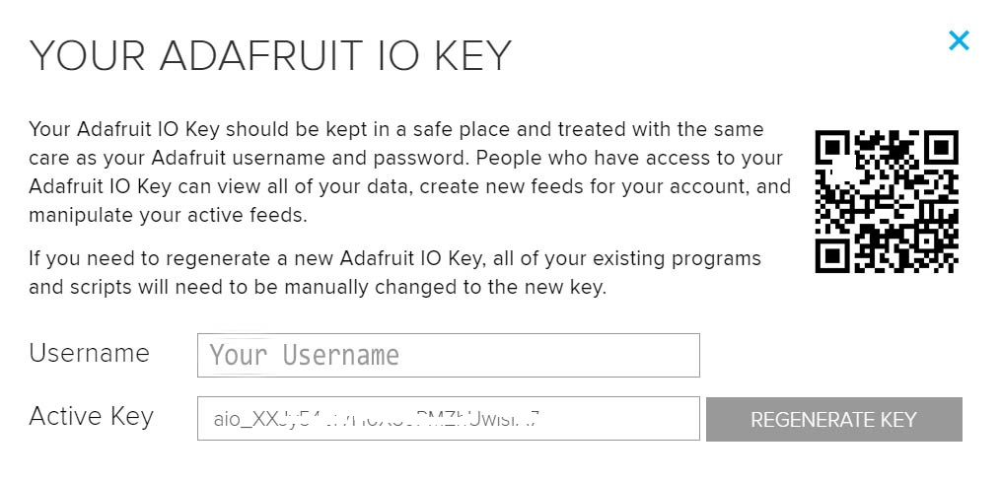

...and paste in our code as shown in the example below. 

```cs
var key = "aio_XXJy54zT7H0X89PMZhUwlsfA7";
```
We now have all the elements we need to complete the code in our sample. Here are the values we created and need to add. 

```cs
var dashboardId = "SITCore";
var username = "Your Username";
var key = "aio_XXJy54zT7H0X89PMZhUwlsfA7";
var feed = "your username/feeds/ToggleSwitch";
```
Deploy your program to your SITCore IoT device, once launched the gauge on our Dashboard will start at 50 and increment by 5 every 2 seconds. Clicking on the 'Toggle Switch' will send the value to our device, which can be seen in Visual Studio's output window. 

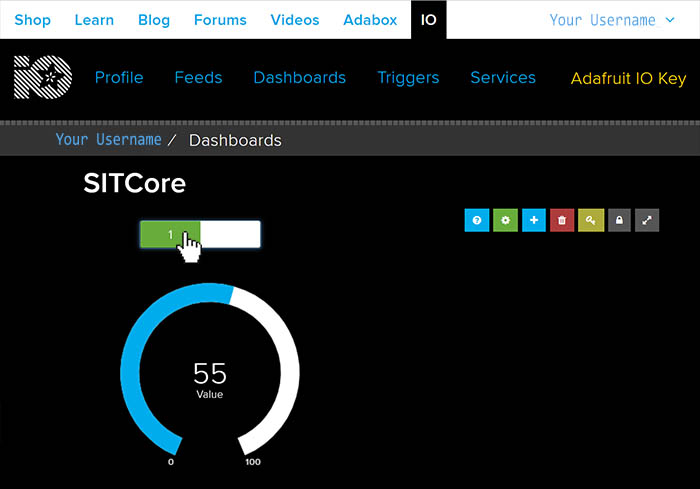


## Using MQTT

```cs
var caCertSource = Properties.Resources.GetBytes(Properties.Resources.BinaryResources.DigiCertGlobalRootG2);
X509Certificate CaCert = new X509Certificate(caCertSource);

var mqttHost = "io.adafruit.com";
var mqttPort = 8883; //Default SSL port is 8883, default insecure port is 1883.
var dashboardId = "Your Dashboard";
var username = "Your Username";
var key = "Your Adafruit IO Key";
var feed = "Feed you wish to subscribe to";

try {
    var clientSetting = new MqttClientSetting {
        BrokerName = mqttHost,
        BrokerPort = mqttPort,
        ClientCertificate = null,
        CaCertificate = CaCert,
        SslProtocol = System.Security.Authentication.SslProtocols.Tls12,
    };

    var client = new Mqtt(clientSetting);

    var connectSetting = new MqttConnectionSetting {
        ClientId = dashboardId,
        UserName = username,
        Password = key
    };

    // Connect to host
    var returnCode = client.Connect(connectSetting);

    if(returnCode == ConnectReturnCode.ConnectionAccepted) 
        Debug.WriteLine("Connected to Adafruit IO");

    var packetId = 1;

    // Subscribe to a feed
    client.Subscribe(new string[] {feed}, new QoSLevel[] { QoSLevel.ExactlyOnce },
        (ushort)packetId++);

    // Publish to a feed
    client.PublishReceivedChanged += Client_PublishReceivedChanged;
    var dx = 5;
    var x = 50;
    while (true) {
        x += dx;
        if (x >= 100 || x <= 0)
            dx *= -1;
            // Publish a topic
            client.Publish("your username/feeds/gauge", Encoding.UTF8.GetBytes(" " + x),
            QoSLevel.MostOnce, false, (ushort)packetId); //Sets gauge
            Thread.Sleep(2000);
    }               
}

catch (Exception e) {

}
Thread.Sleep(-1);
}
private static void Client_PublishReceivedChanged(object sender, MqttPacket packet) {
    if (packet.Data[0] == '1') { //Toggle is set to '1'
        Debug.WriteLine("ToggleSwitch set to 1");
    }
    if (packet.Data[0] == '0') {  //Toggle is set to '0'
        Debug.WriteLine("ToggleSwitch set to 0");
    }
}

```


## Using HTML

Your IoT device can communicate with Adafruit IO using simple HTTP GET and POST commands. However, to respond to input on your Adafruit IO dashboard you must repeatedly execute HTTP GET requests to poll the input. If you would rather use event driven input from Adafruit IO, MQTT is a better choice than HTML.

The following code uses an HTTP POST request to send a value to an Adafruit IO feed named "Gauge" which is represented by a gauge on an Adafruit IO dashboard. It uses a secure connection, so you must have the Adafruit certificate loaded as a [resource](resources.md). There must be a working Internet connection for this code to work.

```cs
var url = "http://io.adafruit.com/api/feeds/temperature/data.json";

var postData = "{\"value\":\"20\"}"; //Sending a value of 20.

var byteArray = System.Text.Encoding.UTF8.GetBytes(postData);

var cert = Resource.GetBytes(Resource.BinaryResources.DigiCertGlobalRootG2);

certx509 = new X509Certificate[] { new X509Certificate(cert) };

int read = 0, total = 0;
byte[] result = new byte[512];

try {
    using (var postRequest = HttpWebRequest.Create(url) as HttpWebRequest) {
        postRequest.KeepAlive = false;
        postRequest.HttpsAuthentCerts = certx509;
        postRequest.ReadWriteTimeout = 2000;
        postRequest.Headers.Add("x-aio-key: your_adafruit_io_key_goes_here");
        postRequest.ContentType = "application/json";
        postRequest.Method = "POST";
        postRequest.ContentLength = byteArray.Length;

        System.IO.Stream dataStream = postRequest.GetRequestStream();
        dataStream.Write(byteArray, 0, byteArray.Length);
        dataStream.Close();

        using (var res = postRequest.GetResponse() as HttpWebResponse) {
            using (var stream = res.GetResponseStream()) {
                do {
                    read = stream.Read(result, 0, result.Length);
                    total += read;

                    System.Diagnostics.Debug.WriteLine("read : " + read);
                    System.Diagnostics.Debug.WriteLine("total : " + total);

                    String page = "";

                    page = new String(System.Text.Encoding.UTF8.GetChars
                        (result, 0, read));

                    System.Diagnostics.Debug.WriteLine("Response : " + page);
                }

                while (read != 0);
            }
        }
    }
}
catch {

}
```

You can use an HTTP GET request to read the status of an Adafruit IO feed. The following code reads that status of a toggle block called "Digital." You will need the rename the toggle's `Button On Text` to "1" and the `Button Off Text` to "0" on the Adafruit IO dashboard. There must be a working Internet connection for this code to work.

```cs
url = "https://io.adafruit.com/api/v2/adafruit_io_username/
    feeds/toggleswitch/data?include=value&limit=1";

var cert = Resource.GetBytes(Resource.BinaryResources.DigiCertGlobalRootG2);

certx509 = new X509Certificate[] { new X509Certificate(cert) };

using (var getRequest = HttpWebRequest.Create(url) as HttpWebRequest) {
    getRequest.KeepAlive = false;
    getRequest.HttpsAuthentCerts = certx509;
    getRequest.ReadWriteTimeout = 2000;
    getRequest.Headers.Add("x-aio-key: your_adafruit_io_key_goes_here");
    getRequest.Method = "GET";

    using (var response = getRequest.GetResponse() as HttpWebResponse){
        using (var stream = response.GetResponseStream()) {
            do {
                read = stream.Read(result, 0, result.Length);
                total += read;

                System.Diagnostics.Debug.WriteLine("read : " + read);
                System.Diagnostics.Debug.WriteLine("total : " + total);

                String page = "";

                page = new String(System.Text.Encoding.UTF8.GetChars
                    (result, 0, read));

                System.Diagnostics.Debug.WriteLine("Response : " + page);
            }
            while (read != 0);
        }
    }
}
```

