# Google Cloud
---
This example shows how to communicate with Google Cloud Platform using MQTT. You'll also need to set up a Network Interface connection on the device such as [WiFi](wifi.md) to Connect to Google Cloud in your program.


>[!TIP]
>Needed Nugets: GHIElectronics.TinyCLR.Networking.Mqtt
>
>Add using statement:
> using System.Security.Cryptography.X509Certificates;

```cs
string iotHubName = "mqtt.googleapis.com";
int iotPort = 8883;

var projectId = "Your ProjectID";
var cloudRegion = "Your Cloud Region";
var registryId = "Your Registry";
var deviceId = "Your DeviceID";
var gatewayId = "Your GatewayID";

var clientId = $"projects/{projectId}" +
    $"/locations/{cloudRegion}" +
    $"/registries/{registryId}" +
    $"/devices/{gatewayId}";

var message = "My message";

var caCertSource = Properties.Resources.GetBytes(Properties.Resources.BinaryResources."GOOGLE Root CERT");

X509Certificate CaCert = new X509Certificate(caCertSource);

var clientSetting = new MqttClientSetting {
    BrokerName = iotHubName,
    BrokerPort = iotPort,
    CaCertificate = CaCert,
    ClientCertificate = null,
    SslProtocol = System.Security.Authentication.SslProtocols.Tls12
};

var iotClient = new Mqtt(clientSetting);

var jwt = "Your JSON Web Token";

iotClient.PublishReceivedChanged += (a, b) => { Debug.WriteLine("Publish Received Changed:" + new string(System.Text.UTF8Encoding.UTF8.GetChars(b.Data))); };
iotClient.PublishedChanged += (a, b, c) => { Debug.WriteLine("Published Changed."); }; 
iotClient.SubscribedChanged += (a, b) => { Debug.WriteLine("Subscribed Changed."); };
iotClient.ConnectedChanged += (a) => { Debug.WriteLine("Connected Changed."); };
iotClient.UnsubscribedChanged += (a, b) => { Debug.WriteLine("Unsubscribed Changed."); };

var connectSetting = new MqttConnectionSetting {
    ClientId = clientId,
    UserName = "unused",
    Password = jwt
};

string topic = $"/devices/{deviceId}/events";

var returnCode = iotClient.Connect(connectSetting);

if (returnCode == ConnectReturnCode.ConnectionAccepted) {

    Gcp_SetupMqttTopics(iotClient, gatewayId);
    Gcp_AttachDevice(iotClient, deviceId, "{}");

    while (true) {
        iotClient.Publish(topic
                , UTF8Encoding.UTF8.GetBytes("" + message + cnt)
                , QoSLevel.LeastOnce
                , false, 1);
        cnt++;
        Thread.Sleep(5000);
    }
}

Thread.Sleep(-1);
        
static void Gcp_SetupMqttTopics(Mqtt client, string deviceId) {
    // The configuration topic is used for acknowledged changes.
    string mqttConfigTopic = $"/devices/{deviceId}/config";
    // The commands topic is used for frequent, transitory, updates.
    string mqttCommandTopic = $"/devices/{deviceId}/commands/#";
    string mqttErrorTopic = $"/devices/{deviceId}/errors";

    string[] topics = new string[] {
        mqttConfigTopic,
        mqttCommandTopic,
        mqttErrorTopic
    };

    QoSLevel[] qosLevels = new QoSLevel[] {
        QoSLevel.LeastOnce, // config topic, Qos *1*
        QoSLevel.MostOnce, // command topic, Qos 0
        QoSLevel.MostOnce // error topic, Qos 0
    };

    client.Subscribe(topics, qosLevels, 1);
}

static void Gcp_AttachDevice(Mqtt client, string deviceId, string auth) {
    var attachTopic = $"/devices/{deviceId}/attach";

    var BinaryData = Encoding.UTF8.GetBytes(auth);
    client.Publish(attachTopic, BinaryData, QoSLevel.LeastOnce, true, 1);

    Debug.WriteLine("Waiting for device to attach about 5 seconds");

    Thread.Sleep(5);
}
```

This example requires projectId, cloudRegion, registryId, gatewayId, and deviceId, which will be available when you register a Google Cloud account.

a client certificate and private key are also provided when you register your account.

Let's create a new project. Click on 'Create Project' on the Manage resources dashboard.


Next we'll need to create a meaningful name, for this project will call it SITCoreIoT. 

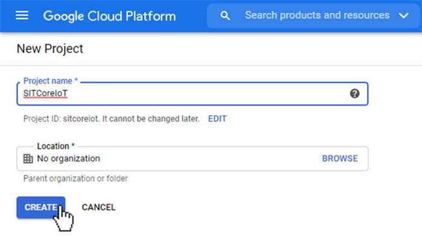

In the search box type 'IoT Core' and then select it. 

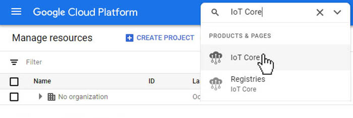

Next, we need to 'ENABLE' the Google Cloud IoT API. 

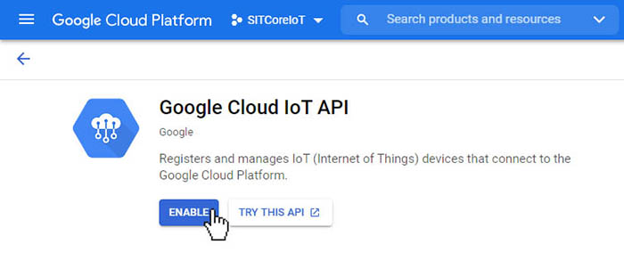

Next we'll need to create a Registry for our project. Click on 'CREATE REGISTRY'

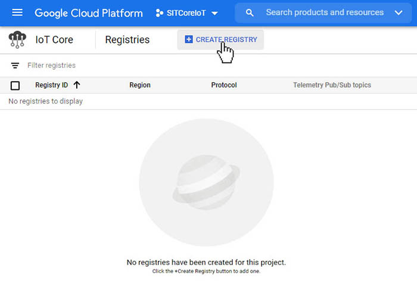

We need to create a 'Registry ID', select a cloud 'Region', and a create a 'Topic'. Finally, we need to click on the 'SHOW ADVANCED OPTIONS' Tab to finish the creation


For this exercise we only need MQTT, and we've selected 'Debug' under Cloud Logging. This isn't necessary but will allow us to see device activity in the log and may be useful for more complex programs. Finally click the 'CREATE' button. 

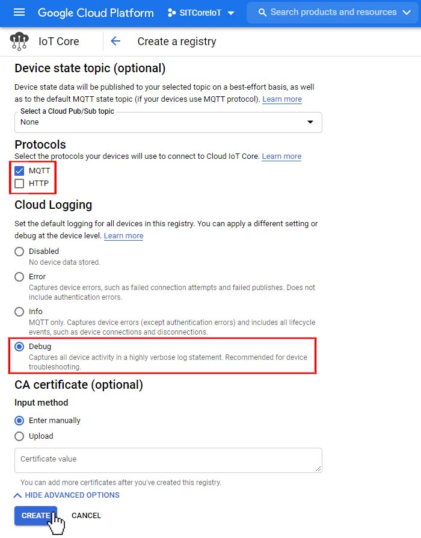

Once created we're taken to the Registry details dashboard. We need to create our device by clicking on 'Devices' from the left menu. 

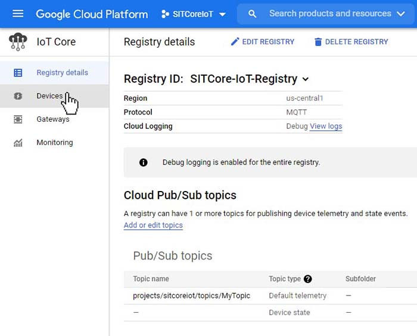

From the Device dashboard, click on 'CREATE A DEVICE' 

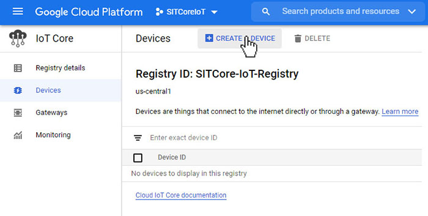

Before we continue, we'll need to generate both a Private and Public key that we can attach to our Device. This can be done with a program like OpenSSL (secure), or we can use a third-party site to generate one for us for testing (unsecure). For this exercise, we'll use a third-party site like:

[CryptoTool.net](https://cryptotools.net/rsagen)

We need to select a Key Length of 2048, and then click 'Generate key pair'. Next, we need to copy the Public Key to the clipboard and use it in a moment. Keep the window open, we'll need to use the Private key later. 

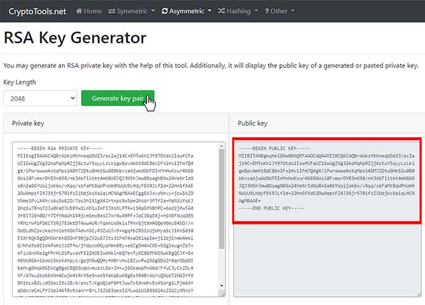

Now let's go back to the 'Create a device' dashboard in Google. We need to create a name for our Device, this will be the 'Device ID'. Before we click 'CREATE' we need to click on the 'COMMUNICATION, CLOUD LOGGING, AUTENTICATION drop down. 

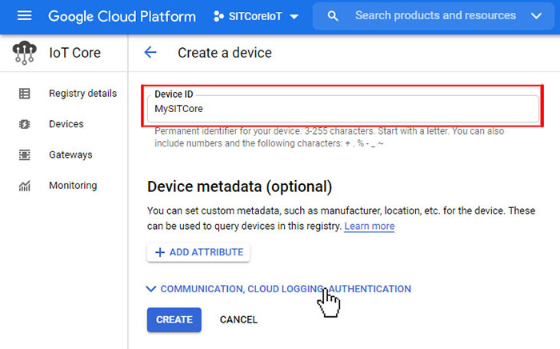

Here we'll paste the Public key we generated earlier. Make sure the Public key format is set to RS256. Then click on 'CREATE' button. 


Next we'll create a Gateway. From inside the Device details dashboard select 'Gateways' from the menu on the left.

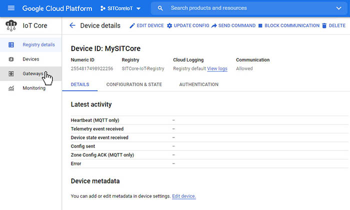

Click on the 'CREATE A GATEWAY'

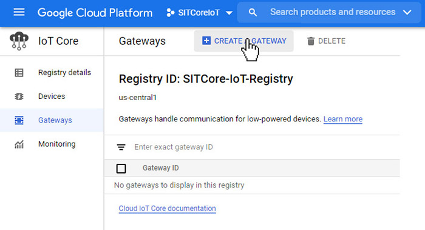

Next will name our Gateway, this will be the 'Gateway ID' that we will add to our code. Before we click 'CREATE', click on the 'COMMUNICATION, CLOUD LOGGING, AUTHENTICATION tab. 

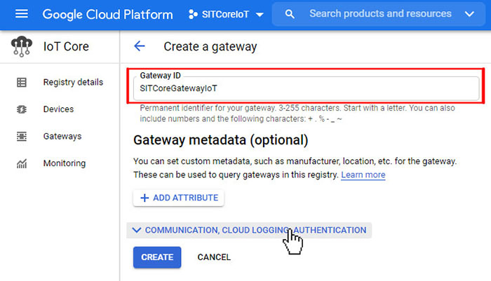

We have to add the same Public key we pasted earlier here too. Make sure that the key format is also set to RS256. Then click on 'CREATE' button.

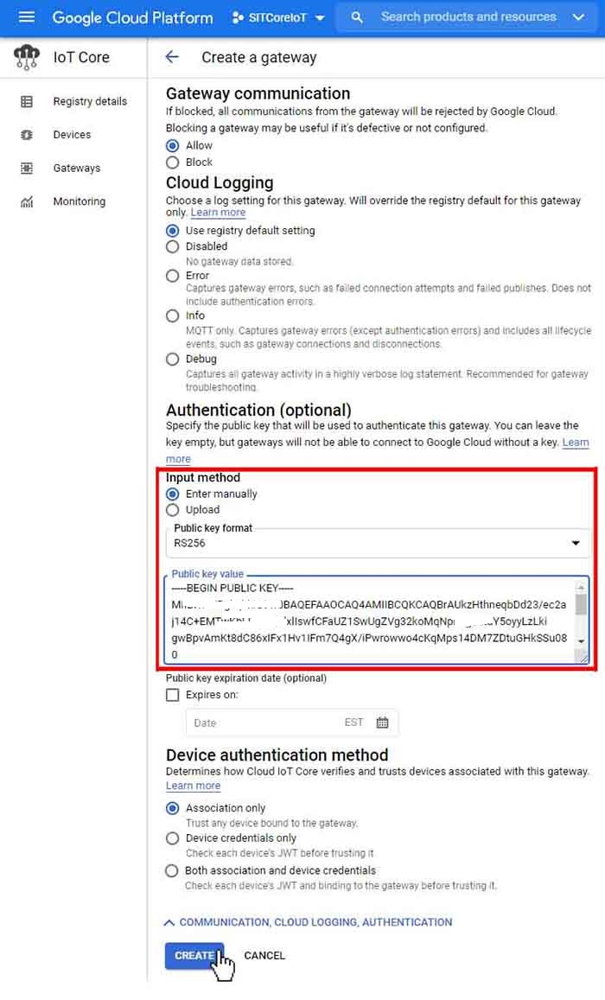

Finally, lets bind our Device to the Gateway. Click on 'BOUND DEVICES' tab and then click on the 'BIND DEVICES' button. Select our Device from the list and click 'BIND' 

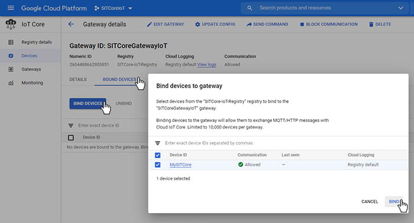

We have the data we need now let's plug in all the IDs we created into our code

```cs
var projectId = "sitcoreiot";
var cloudRegion = "us-central1";
var registryId = "SITCore-IoT-Registry";
var deviceId = "MySITCore";
var gatewayId = "SITCoreGatewayIoT";
```
We need to add a Google Root CA Certificate to our resources and add it to this line of our code. 

```cs
var caCertSource = Properties.Resources.GetBytes(Properties.Resources.BinaryResources."GOOGLE Root CERT");
```

Lastly when connect to google cloud, you also need a JWT (JSON Web Token) to be used as password if using MQTT.

For an easy way to generate a JWT visit https://jwt.io/. However, if you are concerned about sharing your private key with a third party site, there are a multitude of other options. 

>[!WARNING]
> By using https://jwt.io/, your private key is shared with a third-party. This should be used only for testing purpose."

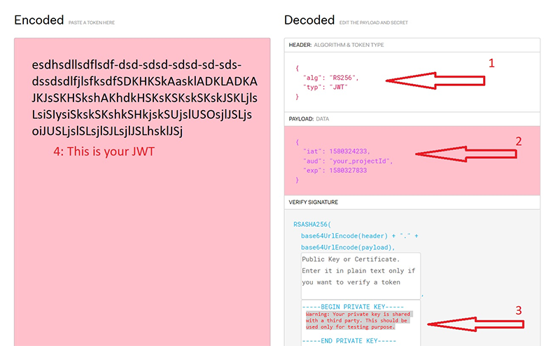

We must change the 'PAYLOAD DATA' to match the image above. There are two fields `iat` (issue at), and `exp` (expire), they contain time in Unix Timestamp format. 

You can convert them online at https://www.epochconverter.com/

```cs
{
  "iat": 1602616824,
  "aud": "sitcoreiot",  
  "exp": 1602616858
}
```

Finally copy your Endoded Token into this line of code in your program:

```cs
var jwt = "Paste your JWT here";
```

>[!NOTE]
>The google cloud connection accepts a maximum expire time of 24 hours, meaning the timespan between `iat` and `exp` must be less than 24 hours.

To receive a message from Google Cloud click on the 'SEND COMMAND' under the Gateway dashboard.


Enter your message and click 'SEND'

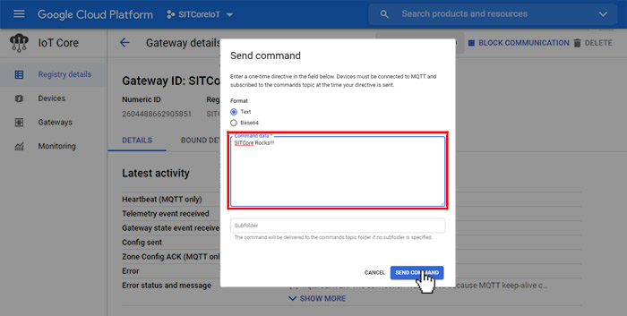

The device will receive your message and display it in the Output window of Visual Studio. 

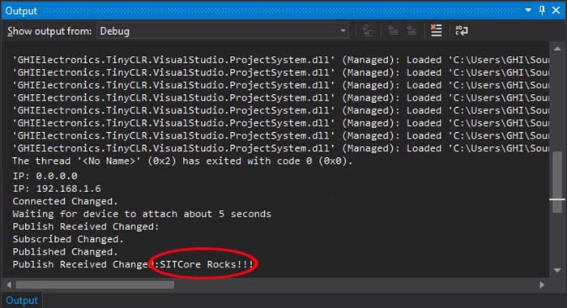

To view the messages being sent from the device to the cloud we need to add a subscription to 'MyTopic'. To do this we need to go to the Registry dashboard and click on the topic we created called 'MyTopic' 

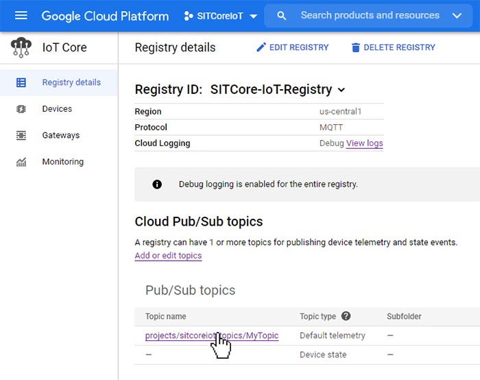

Once on the 'Pub/Sub' dashboard, select 'Subscriptions' from the side menu.

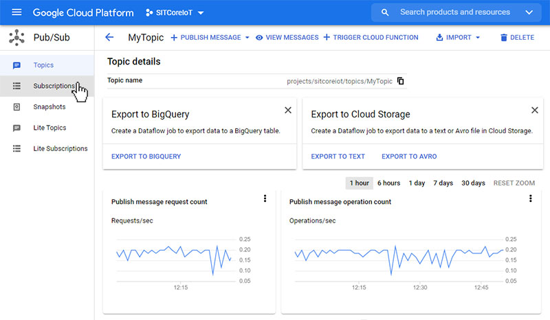

Next, click on 'CREATE SUBSCRIPTION'

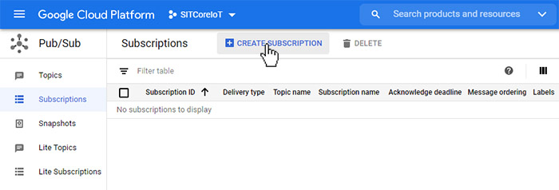

Create a name for in the 'Subscription ID' box and select topic we created earlier. There may be additional setting on this dashboard you can use, but for this tutorial we only need to set these two items. Click the 'CREATE' button at the bottom. 

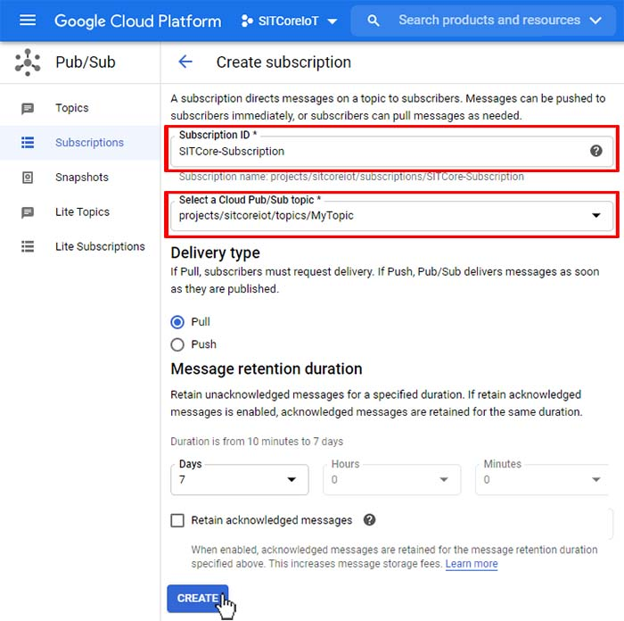

Deploy the program to your device. Once connected, inside the 'Subscription details' dashboard, click on 'VIEW MESSAGES', inside the 'Messages' Pop-up click on the 'PULL' button. This will display the latest messages being sent from the device. The tutorial program sends a new message every 5 seconds and then increments the count by one. We can also continue to send messages to the device from the 'Gateway' dashboard as we did earlier. 

 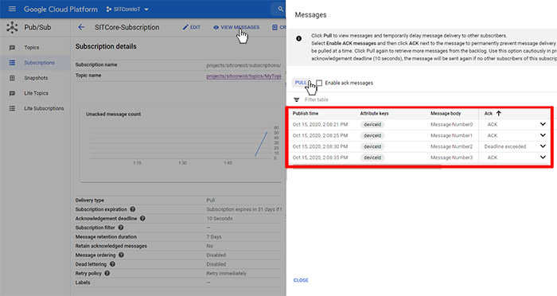
