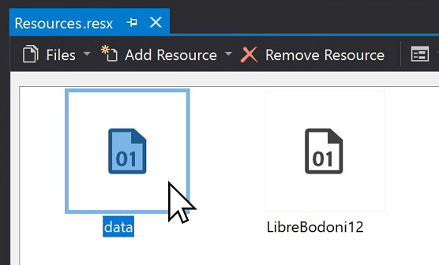

# Resources
---
Resource files can be used to store strings, images, audio files, and other binary or text files that will be used by your application.

Right-click on your project and `Add->New Item...`. From here select `Resource File`.

You can now drag resources right into the file.



In the background, a file is generated to reflect the added resources. Using the resource will look similar to `var resourceData = Resource.GetBytes(Resource.BinaryResources.data);`


> [!Tip]
> If you are copying example code that uses resource files, some changes may be needed to match the resources' names in your project.

## Partial loading
A device has large memory can load entire of resource without any problem.

For a small device, if memory is not enough for loading full resource, there is a way to load partials of resource. 

```
    var readSize = resourceSize / 4; // split resource size

    var resourceId = (short)Resources.BinaryResources.YourResourceId;

    for (var i = 0; i < 4; i++)
    {
        var offset = i * readSize;
        var data = (byte[])(Resources.ResourceManager.GetObject(resourceId, offset, readSize));

        // TODO with data
    }

```

